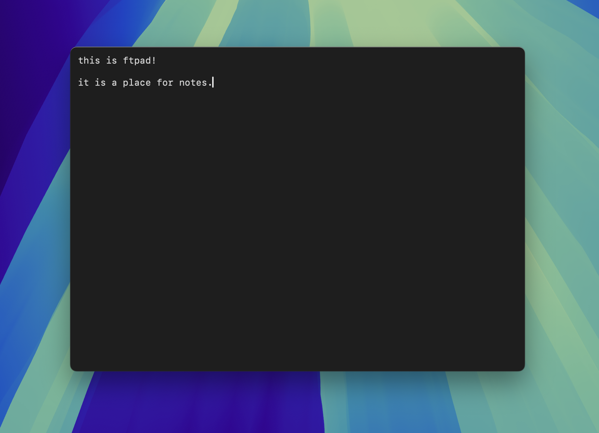

# ftpad




## Use

Press Ctrl+Shift+Space to show/hide. Type.

## Install

Requires Xcode Command Line Tools (`xcode-select --install`).

```sh
git clone https://github.com/fivethirty/ftpad
cd ftpad
git checkout $(git describe --tags --abbrev=0)
sh build.sh
cp -r ftpad.app /Applications/
```

## Configuration

Customize the following things in `~/.config/ftpad/config.json`.

```json
{
  "font": "Menlo",
  "fontSize": 14,
  "backgroundColor": "#1e1e1e",
  "textColor": "#d4d4d4",
  "lightScrollbar": true,
  "shortcut": "ctrl+shift+space",
  "width": 700,
  "height": 500
}
```
